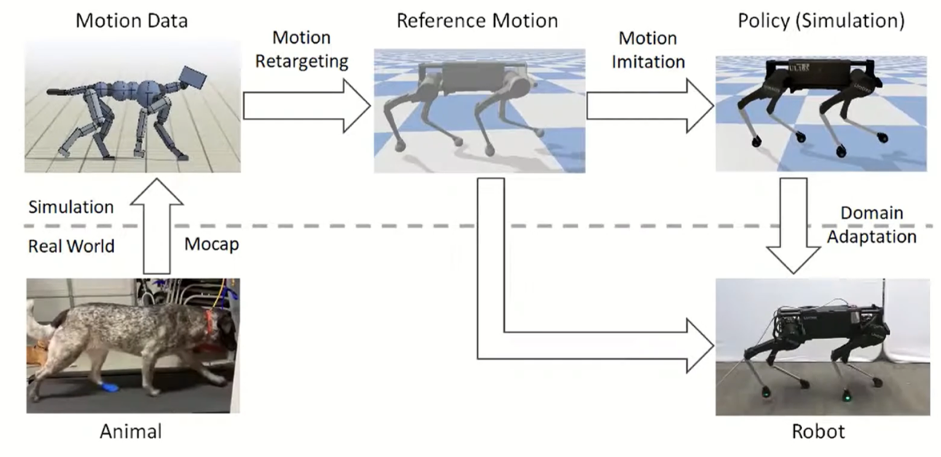

# Motion Imitation

### Project Framework

The main objective of the project is to realize robust control in real quadruped robot by motion imitation and sim2real transfer.

The first step is to collect motion label from real animal by motion capture. After that, we use RL and imitation learning methods to train a policy in simulator with physics engine to mimic the motion data (which is my job in this project). After that, we use sim2real techniques to transfer the policy in simulator to real robot machine and achieve our goal.

### Code Part

The code is included in CodeSample directory, which includes the entire training code for motion imitation.
Our learning algorithm includes mutual learning, divide and conquer strategy.

### Demo

The 1min vedio (Demo.mp4) demostrates the performance of the trained policy in mimicing the motion data, which includes moving forward/backward, turning around, squating down and scampering. As we can see, our trained policy can imitate a long motion approximately correct.